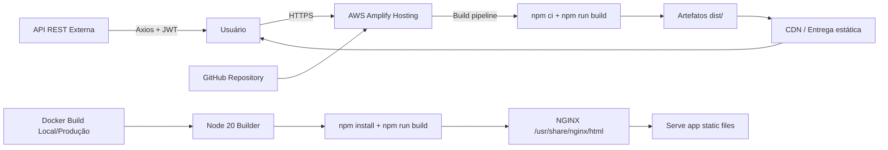
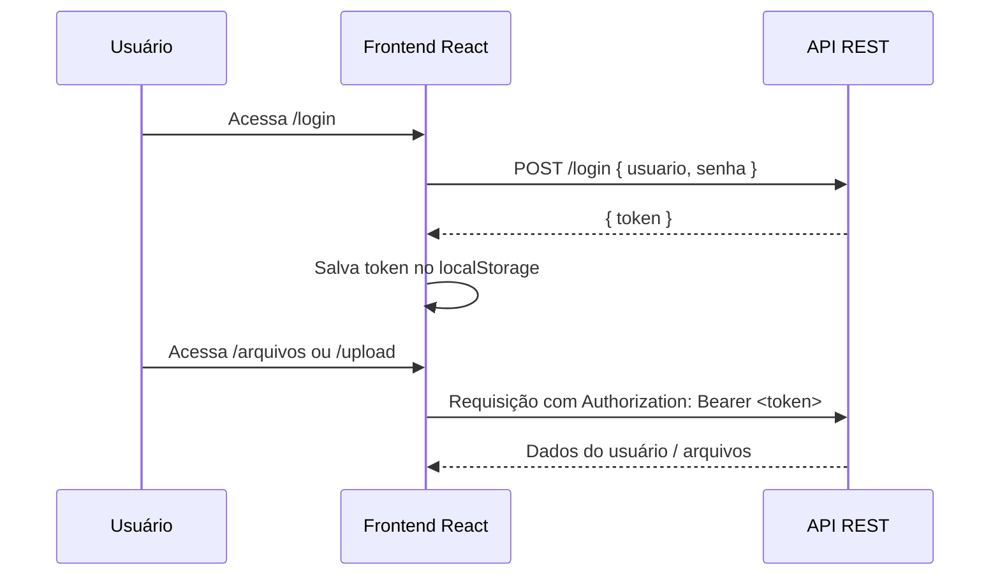

# PDF Vault

Aplicação front-end para autenticação de usuários e gestão de arquivos PDF, desenvolvida em React + TypeScript com Vite. A interface oferece telas de cadastro, login, listagem e upload de documentos, com autenticação baseada em token armazenado no navegador.

## Visão geral

- `/cadastro` — criação de conta
- `/login` — autenticação do usuário
- `/arquivos` — listagem de PDFs com acesso protegido
- `/upload` — envio de arquivo PDF com nome

## Stack tecnológica

- React 19
- TypeScript
- Vite
- React Router DOM
- Axios
- Tailwind CSS 4
- Docker
- AWS Amplify para deploy do frontend

---

## Arquitetura construída na AWS

A infraestrutura observada no repositório demonstra uma solução de frontend estático hospedado na AWS, com build automatizado por pipeline do AWS Amplify.

### Componentes da arquitetura

- Repositório GitHub com o código fonte
- AWS Amplify Hosting para build e deploy do frontend
- Distribuição/CDN gerenciada pelo Amplify para entrega estática da aplicação
- Container Docker para empacotar a aplicação em ambiente consistente
- NGINX como servidor web para servir os arquivos gerados pelo build
- API REST externa, consumida pelo frontend via Axios e token JWT

> O projeto não contém infraestrutura de backend em código. O arquivo `amplify.yml` mostra que o foco desta aplicação é o frontend, e a API de autenticação e arquivos é um serviço externo ao repositório.

### Fluxo de deploy na AWS

1. O código é enviado para o repositório.
2. O AWS Amplify identifica a aplicação frontend.
3. O pipeline executa:
   - `npm ci`
   - `npm run build`
4. Os artefatos gerados em `dist/` são publicados.
5. O frontend é entregue via CDN/HTTPS para os usuários.

O comportamento de build fica explícito no arquivo de configuração do Amplify:

```yaml
version: 1
frontend:
  phases:
    preBuild:
      commands:
        - npm ci
    build:
      commands:
        - npm run build
  artifacts:
    baseDirectory: dist
    files:
      - '**/*'
  cache:
    paths:
      - node_modules/**
```

Esse arquivo confirma que a aplicação é tratada como um frontend estático e que o build é gerado diretamente pela plataforma de hosting.

---

## Docker no processo de build

Além do deploy na AWS, o projeto também utiliza Docker para construir a imagem final da aplicação. Isso garante consistência entre ambientes de desenvolvimento e produção.

### Dockerfile

```dockerfile
FROM node:20-slim AS builder

WORKDIR /app

RUN apt-get update && \
    apt-get install -y build-essential python3 ca-certificates --no-install-recommends && \
    rm -rf /var/lib/apt/lists/*

COPY package.json package-lock.json* ./
ENV npm_config_build_from_source=true
RUN npm install

COPY . .
RUN npm run build

FROM nginx:stable-alpine
COPY --from=builder /app/dist /usr/share/nginx/html
COPY docker/default.conf /etc/nginx/conf.d/default.conf
EXPOSE 80
CMD ["nginx", "-g", "daemon off;"]
```

### O que esse Dockerfile faz

- Usa uma imagem base Node 20 para realizar o build da aplicação.
- Instala dependências do sistema necessárias para módulos nativos.
- Executa `npm install` e `npm run build`.
- Copia o conteúdo de `dist/` para uma imagem final baseada em NGINX.
- Expõe a porta 80 e sobe o servidor web para servir a aplicação estática.

### Configuração do NGINX

```nginx
server {
  listen 80;
  server_name _;
  root /usr/share/nginx/html;
  index index.html;

  location / {
    try_files $uri $uri/ /index.html;
  }
}
```

Esse arquivo é importante porque permite que o frontend em React execute rotas do cliente sem quebrar ao recarregar páginas diretamente no navegador.

---

## Diagrama de arquitetura

### Visão geral da solução



### Fluxo de autenticação e uso



---

## Como executar localmente

### Sem Docker

```bash
npm install
npm run dev
```

A aplicação fica disponível em:

```text
http://localhost:5173
```

### Com Docker

```bash
docker build -t pdf-vault .
docker run -p 80:80 pdf-vault
```

Também existe um ambiente de desenvolvimento com Docker Compose:

```yaml
version: '3.8'
services:
  app:
    build:
      context: .
      dockerfile: Dockerfile.dev
    volumes:
      - ./:/app:cached
      - /app/node_modules
    ports:
      - "5173:5173"
    environment:
      - CHOKIDAR_USEPOLLING=true
    command: sh -c "npm install --no-audit --prefer-offline --silent && npm run dev -- --host 0.0.0.0 --port 5173"
```

---

## Observações importantes

- O projeto é principalmente um frontend e depende de uma API externa para autenticação e persistência de arquivos.
- A autenticação ocorre com token em `localStorage`, e o cliente HTTP anexará o cabeçalho `Authorization` em requisições protegidas.
- O build de produção gera a pasta `dist`, que é publicada pelo Amplify e servida por NGINX no container.
- O uso de Docker em produção e no desenvolvimento reforça a portabilidade e a garantia de um ambiente consistente para o app.

---

## Estrutura principal do projeto

```text
.
├── amplify.yml
├── Dockerfile
├── Dockerfile.dev
├── docker/
│   └── default.conf
├── docker-compose.dev.yml
├── package.json
├── public/
├── src/
│   ├── api/
│   ├── components/
│   ├── context/
│   ├── models/
│   ├── pages/
│   ├── App.tsx
│   ├── index.css
│   └── main.tsx
├── tsconfig.json
├── vite.config.ts
└── README.md
```

---

## Conclusão

A arquitetura do projeto combina um frontend React moderno com deploy em AWS Amplify e empacotamento em Docker. O arquivo `amplify.yml` define a pipeline de build e publicação, enquanto o `Dockerfile` demonstra a estratégia de containerização para servir a aplicação via NGINX. Em conjunto, isso resulta em uma solução leve, escalável e simples de publicar, com foco em entrega estática e integração com uma API externa para autenticação e armazenamento de arquivos.

## Visualização do Projeto (seção onde adiciona os arquivos)


